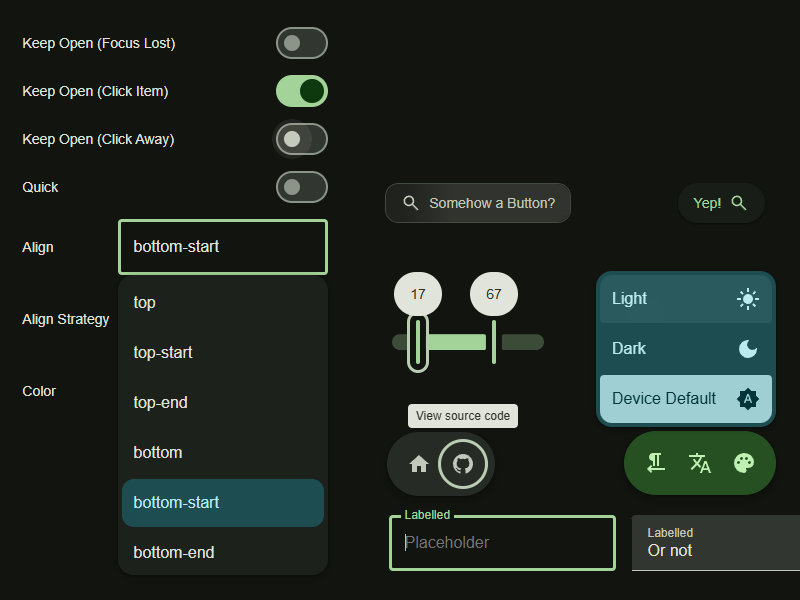

# seele

[](https://www.npmjs.com/package/@vollowx/seele)
[](https://builds.sr.ht/~lucaz/seele?)
[](https://www.webcomponents.org/element/@vollowx/seele)

[https://tideover.cc/seele/](https://tideover.cc/seele/)
[docs/](https://tideover.cc/seele/docs/)

seele (**S**tandard **E**xtensible **Ele**ments) is a extensible
[Web Components][web-comps] library with a focus on accessibility and
keyboard-control.

It also provides styled components in the following design guideline(s):

- [Material You Expressive](https://m3.material.io/)



## Features

What's the differences comparing to other projects?

- Accessible and keyboard-accessible - all components are based on the
  [APG Patterns][apg-patterns]
- Flexible - seele provides not only the styled components, but also the base
  ones and the mix-ins that compose them, allowing you to write your components
  easily
- Up-to-date - seele uses new Web features as much as possible, (see the README),
  meaning that its size is relatively small and the compatibility is not the
  best

## Installation

seele is published on [npm](https://www.npmjs.com/package/@vollowx/seele),
install with your preferred package manager like

```sh
npm install @vollowx/seele
```

## Quickstart

### Importing

You can import the entire library or import as needed.

```javascript
// Import all components
import '@vollowx/seele';

// Or import specific components (recommended)
// They all follow such path: @/catagory/group/component.js
import '@vollowx/seele/m3/button/common-button.js';
import '@vollowx/seele/m3/checkbox/checkbox.js';
```

### Using

Once imported, the components can be used just like standard HTML elements.

```html
<md-button variant="filled">Filled Button</md-button>
<md-button variant="outlined">Outlined Button</md-button>

<label>
  <md-checkbox checked></md-checkbox>
  Labelled Checkbox
</label>
```

### Theming

seele components use CSS variables for styling. To include the systems, add
this to your style files.

```css
@import '@vollowx/seele/m3/systems/base.css';
/* This includes basic system variables like motion system and typography system */
@import '@vollowx/seele/m3/systems/defaults.css';
/* (Optional) This includes basic styling for body, selection and links */

/*
 * Note that there is no default color system since the way you implement theme
 * switching and color changing varies.
 *
 * You can still find some references in dev/shared.css
 */
```

## Documentations

[Documentations and demos](https://tideover.cc/seele/docs/).

## Download

- [npm package](https://www.npmjs.com/package/@vollowx/seele)
- [The source at SourceHut](https://sr.ht/~lucaz/seele)
- [The source at GitHub](https://github.com/vollowx/seele)

## Browser Support

seele relies on the folling modern web standards:

- [`ElementInternals`](https://developer.mozilla.org/en-US/docs/Web/API/ElementInternals), Baseline 2023
- [Constructable Stylesheets](https://developer.mozilla.org/en-US/docs/Web/API/CSSStyleSheet/CSSStyleSheet), Baseline 2024, C[^1] 90, F 126
- [`:dir()`](https://developer.mozilla.org/en-US/docs/Web/CSS/Reference/Selectors/:dir), Baseline 2023, C 120, F 49
- [`:state()`](https://developer.mozilla.org/en-US/docs/Web/CSS/Reference/Selectors/:state), Baseline 2024, C 125, F 126

And all that result in:

- Chromium: >= 125
- Firefox: >= 126

It is 2026 now, you don't really need to worry about this. But in the future,
these following web features might be used and require higher browser versions:

- [anchor()](https://developer.mozilla.org/en-US/docs/Web/CSS/Reference/Values/anchor), Baseline 2026, C 125, F 147, will remove the dependency `floating-dom`
- [`::view-*`](https://developer.mozilla.org/en-US/docs/Web/CSS/Reference/Selectors/::view-transition), Baseline 2025, C 111, F 144, will optimize some animations for menu, dialog, etc

[^1]: C = Chromium, F = Firefox.

## Other Information

- [Roadmap](./ROADMAP.md)
- [Contributing](./CONTRIBUTING.md)
- [License (Apache-2.0)](./LICENSE)

[web-comps]: https://developer.mozilla.org/en-US/docs/Web/API/Web_components
[apg-patterns]: https://www.w3.org/WAI/ARIA/apg/patterns/
[lit]: https://lit.dev/
